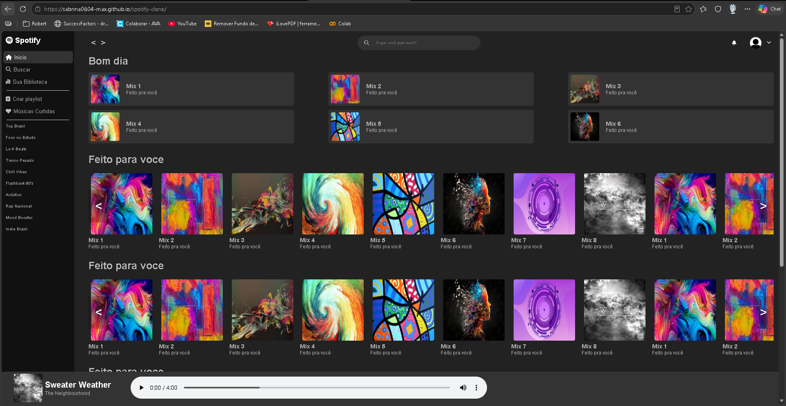

# 🎵 Spotify Clone

Projeto desenvolvido com HTML, CSS e JavaScript inspirado na interface do Spotify.

## 📸 Preview



---

## 🚀 Tecnologias utilizadas

- HTML5
- CSS3
- JavaScript
- Font Awesome

---

## 🎯 Funcionalidades

- Sidebar de navegação
- Barra de pesquisa
- Carrossel horizontal de músicas
- Player de música fixo
- Layout inspirado no Spotify
- Scroll horizontal com botões

---

## 📂 Estrutura do projeto

```bash
📁 projeto
 ├── 📁 img
 ├── 📁 musica
 ├── index.html
 ├── style.css
 ├── script.js
```

---

## ▶️ Como executar o projeto

1. Clone o repositório:

```bash
git clone https://github.com/sabrina0604-max/spotify-clone.git
```

2. Abra o arquivo `index.html` no navegador.

---

## 💻 Demonstração

Você pode acessar o projeto online aqui:

[Acessar Projeto](https://sabrina0604-max.github.io/spotify-clone/)

---

## 📌 Melhorias futuras

- Responsividade mobile
- Integração com API do Spotify
- Sistema de playlists dinâmicas
- Reprodução real de músicas
- Tema claro/escuro

---

## 👨‍💻 Autor

Feito por Sabrina Rodrigues Medeiros (https://github.com/sabrina0604-max)
